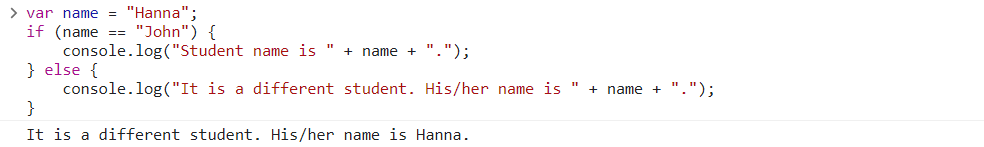

# WEB 601 Week3 Day1 In Class Code-Along Exercise

## 1. Create a function

### Practice 1.1: Create a function with no arguments
**Code**
```JavaScript
function newStudent() {
    console.log("New student is added to the system");
}
```
**Call the function in the console**


### Practice 1.2: Create a function that accepts arguments

**Code**
```JavaScript
var name = "John";
function newStudent(name) {
    console.log("New student " + name + " is added to the system.");
}
```

**Call the function in the console**


## 2. If-else statement

### Practice 2.1: Hit the "else" statement
**Code**
```JavaScript
var name = "Hanna";
if (name == "John") {
    console.log("Student name is " + name + ".");
} else {
    console.log("It is a different student. His/her name is " + name + ".");
}
```

As the variable `name` has the value "Hanna", it is going to hit the "else" statement:

**In the Console**


### Practice 2.2: Hit the "if" statement

Now change the value of the variable `name` to "John", so it is going to hit the "if" statement:
**Code**
```JavaScript
var name = "John";
if (name == "John") {
    console.log("Student name is " + name + ".");
} else {
    console.log("It is a different student. His/her name is " + name + ".");
}
```

**In the Console**


### Practice 2.3: Use "else if"

Now change the value of the variable `name` to "Andrea", and modify the if-else statement as follows:

**Code**
```JavaScript
var name = "Andrea";
if (name == "John") {
    console.log("Student name is " + name + ".");
} else if (name == "John") {
    console.log("It is a different student. His/her name is " + name + ".");
} else if (name == "Michael") {
    console.log("It is a different student. His/her name is " + name + ".");
} else if (name == "Julie") {
    console.log("It is a returning student. His/her name is " + name + ".");
} else {
    console.log("Sorry, no student by the name of " + name + " exists.");
}
```
**In the Console**


## 3. Boolean
### Practice 3.1: Use AND Operator (true && true)

**Code**
```JavaScript
var isDoorLocked = true; var isAlarmOn = true;

if ((isDoorLocked == true) && (isAlarmOn == true)) {
    console.log("House is secure!");
}
```

**In the Console**


### Practice 3.2: Use AND Operator (true && false)

**Code**
```JavaScript
var isDoorLocked = true; var isAlarmOn = false;

if ((isDoorLocked == true) && (isAlarmOn == true)) {
    console.log("House is secure!");
}
```

**In the Console (no output)**


### Practice 3.3: Use OR Operator (true || false)

**Code**
```JavaScript
var isDoorLocked = true; var isAlarmOn = false;

if ((isDoorLocked == true) || (isAlarmOn == true)) {
    console.log("House is secure!");
}
```

**In the Console**


### Practice 3.4: Use OR Operator (false || false)

**Code**
```JavaScript
var isDoorLocked = false; var isAlarmOn = false;

if ((isDoorLocked == true) || (isAlarmOn == true)) {
    console.log("House is secure!");
}
```

**In the Console (no output)**


## 4. Switch-Case

### Practice 4.1: Hit one of the cases

**Code**
```JavaScript
var name = "John";

switch(name) {
    case "John":
        console.log("Student name is " + name + ".");
        break;
    case "Hanna":
        console.log("It's a different student. His/her name is " + name + ".");
        break;
    default:
        console.log("No such student name exists.");
}
```
**In the console**


### Practice 4.2: Hit default case
Not hitting any of the cases, thereby hitting the default case.
**Code**
```JavaScript
var name = "Brent";

switch(name) {
    case "John":
        console.log("Student name is " + name + ".");
        break;
    case "Hanna":
        console.log("It's a different student. His/her name is " + name + ".");
        break;
    default:
        console.log("No such student name exists.");
}
```

**In the console**

