# WEB 601 Week3 Day2 In Class Code-Along Exercise

## 1. Loops
### Exercise 1.1 - For Loop

**Code**
```JavaScript
for (var i = 0; i < 10; i++) {
    console.log(i);
}
```

**Console**
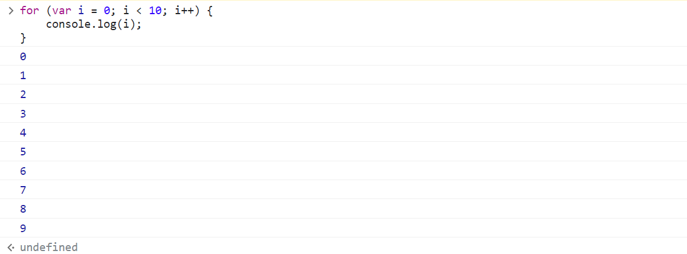

### Exercise 1.2 - While Loop (`i--`)

**Code**
```JavaScript
var entity = "Monster"; var life = 5;

while (life != 0) {
    console.log("Keep " + entity + " on screen");
    life--;
}
```
**Console**
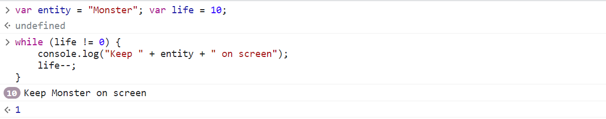
(the "10" in the circle indicates that the output is repeated 10 times)

### Exercise 1.3 - While Loop (`i++`)

**Code**
```JavaScript
var i = 0;

while (i < 10) {
    console.log(i);
    i++;
}
```

**Console**
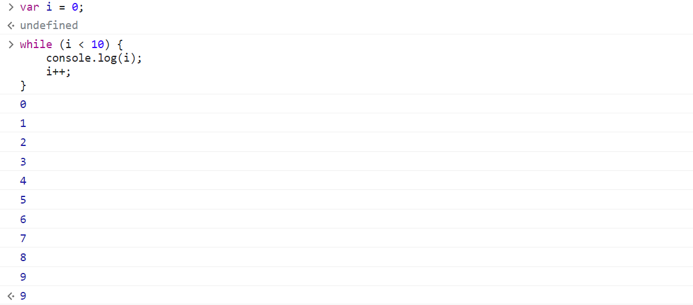

### Exercise 1.4 - Do-While Loop (`i++`)

**Code**
```JavaScript
var entity = "Monster"; var life = 10;

do {
    console.log("Keep " + entity + " on screen");
    life--;
} while (life != 0);
```

**Console**
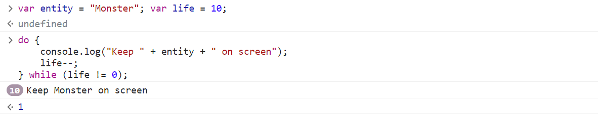

**What makes do-while loop different?**

The do-while loop will execute the "do" statement ***at least once*** even if the while loop condition is not satisfied. For example:

**Code**
```JavaScript
var entity = "Monster"; var life = 0;

do {
    console.log("Keep " + entity + " on screen");
} while (life != 0);
```
At the beginning, `life` is 0, which does not satisfy the while loop, but the do-statement will still be executed once.

**Console**
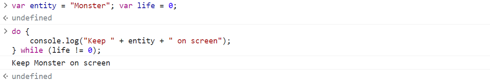
("Keep Monster on screen" is printed once.)

So, what do you think will happen if I run the code below?
```Java
var entity = "Monster"; var life = 0;

do {
    console.log("Keep " + entity + " on screen");
    life--;
} while (life != 0);
```
- A. No output in the console.
- B. There will be one line of "Keep Monster on screen" output in the console.
- C. The loop will run forever.

The answer will be C. As the do-statement will be executed at least once, `life` after the first loop will become -1, which will satisfy the while-loop condition thereafter, making the loop run forever.

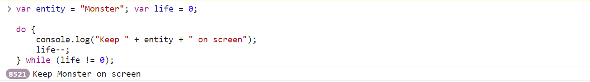
:)

## 2. Array
### Exercise 2.1 - Create an array of strings

**Code**
```JavaScript
var fruits = ["apples", "oranges", "pears"];
```

**Console**
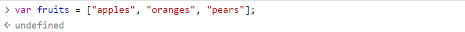

### Exercise 2.2 - Call the built-in functions for array
**2.2.1 - `array.push(.)`**
```JavaScript
fruits.push("grapes");
```

**Console**

(the `4` indicates the return of the `push` function, which is the length of the array after calling `push`)

**2.2.2 - `array.pop()`**

```JavaScript
fruits.pop();
```

**Console**
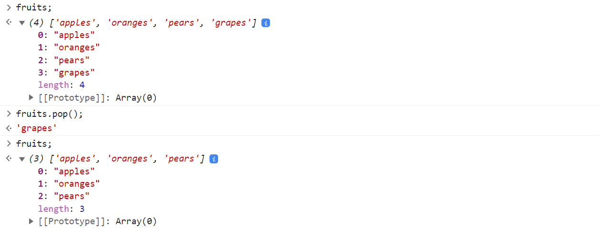
(`'grapes'` indicates the return of the `pop` function, which is the item being popped)

**2.2.3 - `array.shift()`**

```JavaScript
fruits.shift();
```

**Console**
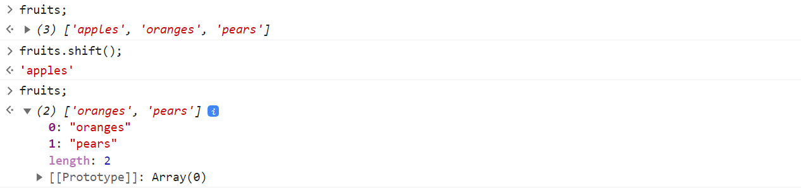
(`'apples'` indicates the return of the `shift` function, which is the item being shifted out)

**2.2.4 - `array.unshift(.)`**

```JavaScript
fruits.unshift("apples");
```

**Console**
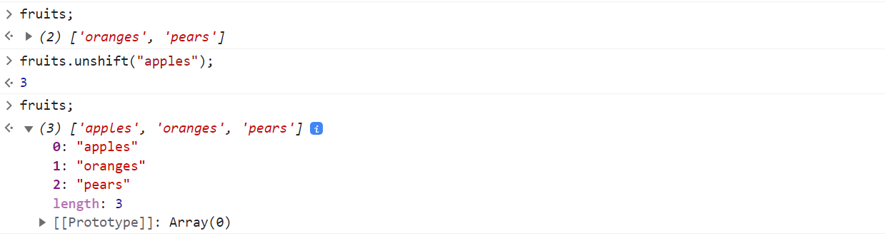
(the `3` indicates the return of the `unshift` function, which is the length of the array after calling `unshift`)

**2.2.5 - `array.splice(.)`**

The `splice()` method of Array instances changes the contents of an array by doing below ***in place***.
- removing or replacing existing elements
- and/or adding new elements<br>

```JavaScript
var months = ['Jan', 'March', 'April', 'June'];

// Inserts at index 1; removing or replacing 0 elements
months.splice(1, 0, 'Feb');
```

**Console**
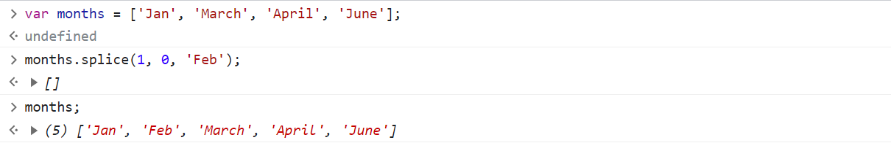
(`[]` indicates the elements being replaced or removed)

```JavaScript
var months = ['Jan', 'Feb', 'March', 'April', 'June'];

// Inserts at index 4; removing or replacing 1 element (with 'May')
months.splice(4, 1, "May");
```

**Console**
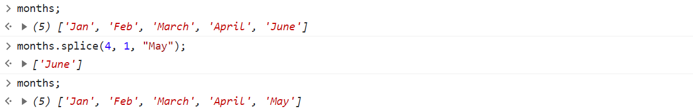
(`['June']` indicates the elements being replaced or removed)

**2.2.6 - `array.slice(.)`**
The `slice()` method of Array instances returns a ***shallow copy*** of a portion of an array into a new array object selected from `start` (optional, default to 0) to `end` (optional, default to the length of the array, left-included-right-excluded).

```JavaScript
var months = ['Jan', 'Feb', 'March', 'April', 'June'];

// shallow-copied a new array starting at index 2, which is 'March'
months.slice(2);
```

**Console**
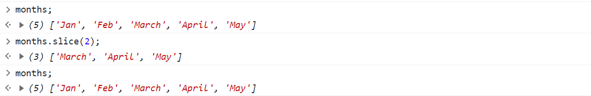
(As seen, `months.slice(2)` returns a "new" (shallow copy to be exact) array, and `months` is not changed.)

**2.2.7 - `array.sort()`**
The `sort()` method of Array instances sorts the elements of an array ***in place***.

```JavaScript
var months = ['Jan', 'Feb', 'March', 'April', 'June'];

months.sort();
```
It should be no supprise that `months` will now be
```JavaScript
// after sort
// ['April', 'Feb', 'Jan', 'June', 'March'];
```
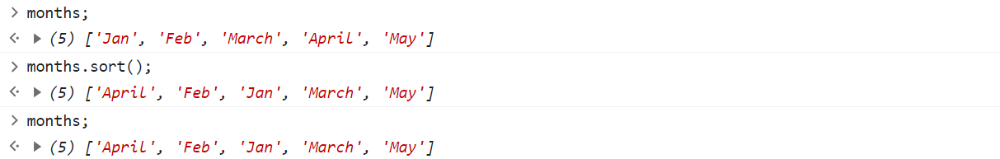

However, it is worth noting that the `sort()` method ***returns the reference*** to the same array, which is sorted now. As shown below, I can assign a variable `sorted_months` to `months.sort()`. When I modify the source array, the reference will be modified too.

**Console**
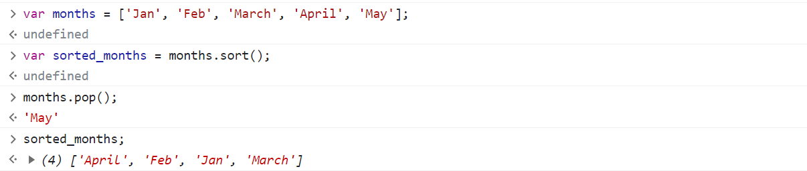

To sort the elements in an array without mutating the original array, you should always use `toSorted()`.
```JavaScript
var months = ['Jan', 'Feb', 'March', 'April', 'May'];
var sorted_months = months.toSorted();

// months will remain the same (unsorted)
console.log(months);
console.log(sorted_months);
```
**Console**
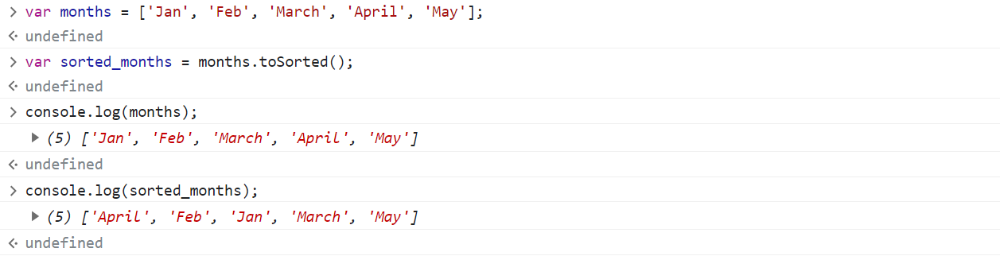

**2.2.8 - `array.reverse()`**

The `reverse()` method of Array instances reverses an array ***in place***.

```JavaScript
var months = ['Jan', 'Feb', 'March', 'April', 'May'];
months.reverse();
months;
```

**Console**
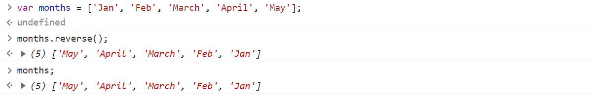

It is also worth noting that it ***returns the reference*** to the same array, now reversed.

To reverse the elements in an array without mutating the original array, you should always use `toReversed()`. The behavior is similar to that in `sort()` and `toSorted()`.

```JavaScript
var months = ['Jan', 'Feb', 'March', 'April', 'May'];
var reversed_months = months.toReversed();

// remains the same
months;

// reversed
reversed_months;
```

**Console**
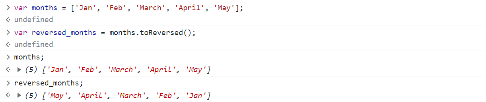

**2.2.9 - `array.concat()`**
```JavaScript
var beenThereList = ["New York", "London"];
var bucketList = ["Shanghai", "Rome"];
var myList = beenThereList.concat(bucketList);

myList;

// neither arrays are changed
beenThereList;
bucketList;
```

**Console**
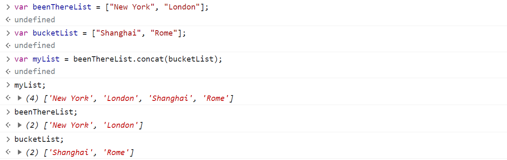

## 3. Popup
### Exercise 3.1 - Alert box

```JavaScript
// either command will produce the same popup window
window.alert("This is alert box!");
// OR
alert("This is alert box!");
```

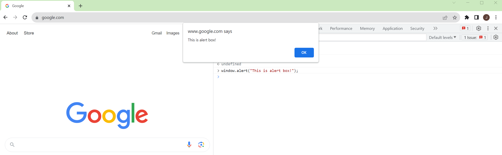
(as the console is created in the Google webpage)

### Exercise 3.2 - Confirm popup

```JavaScript
// either command will produce the same popup window
window.confirm("Do you want to save changes?");
// OR
confirm("Do you want to save changes?");
```

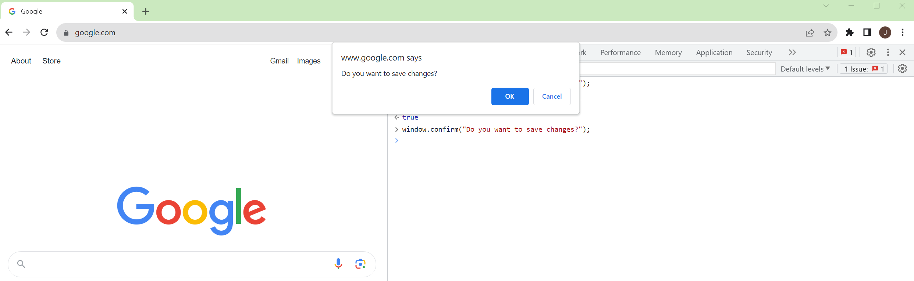

The return is a Boolean value, depending on the option selected (OK -> `true`, Cancel -> `false`)
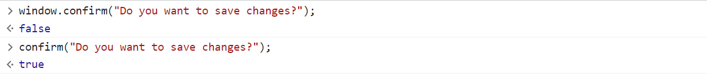

### Exercise 3.3 - Prompt popup

```JavaScript
// either command will produce the same popup window
window.prompt("Enter preferred loan period in years", "15");
// OR
prompt("Enter preferred loan period in years", "15");
```

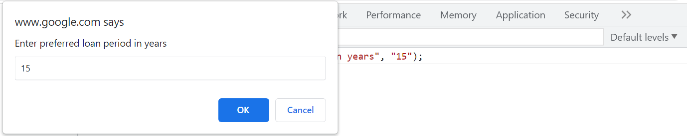

Note that the return of the function is always string, although in this example the input appears to be a number.
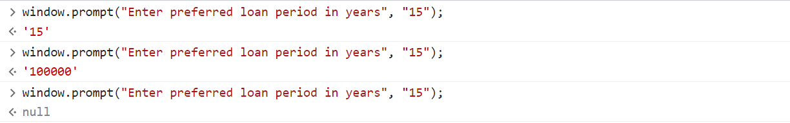
- showing "15" as the default value, clicking "OK" will return `'15'`.
- showing "15" as the default value, providing input "100000" and then clicking "OK" will return `'100000'`.
- showing "15" as the default value, clicking "Cancel" will return `null`.
