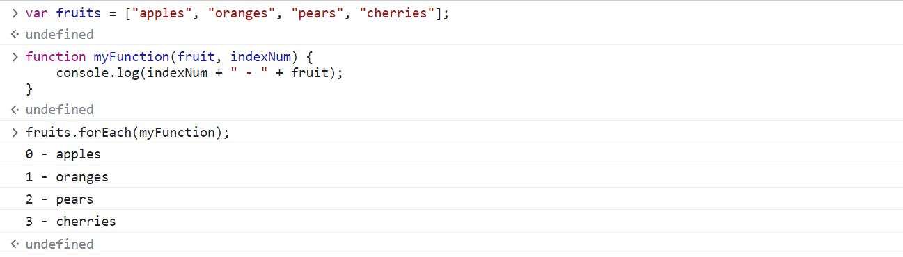
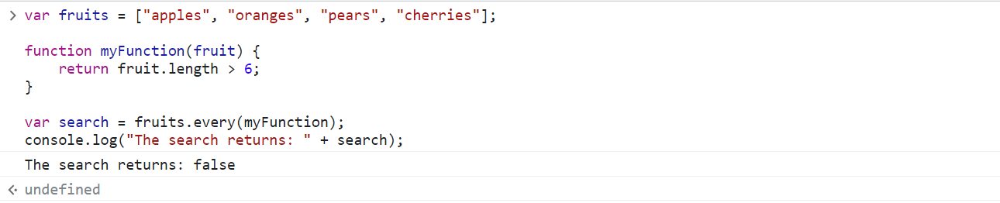

# In-Class Code-Along Exercises

## More Built-in Methods for `Array`
*(`Array.prototype.<method>` means the method is shared by all Array instances)*

### `Array.prototype.indexOf(.)`
returns the first index at which a given element can be found in the array, or -1 if it is not present.

#### Example 1
```JavaScript
var fruits = ["apples", "oranges", "pears", "apples"];

var search = fruits.indexOf("apples");
console.log("The search returns: " + search);
```


#### Example 2
```JavaScript
var fruits = ["apples", "oranges", "pears", "apples"];

var search = fruits.indexOf("bananas");
console.log("The search returns: " + search);
```


---

### `Array.prototype.lastIndexOf(.)`
returns the last index at which a given element can be found in the array, or -1 if it is not present. The array is searched backwards.

```JavaScript
var fruits = ["apples", "oranges", "pears", "apples"];

var search = fruits.lastIndexOf("apples");
console.log("The search returns: " + search);
```


---

### `Array.prototype.forEach(.)`
executes a provided function once for each array element.

```JavaScript
var fruits = ["apples", "oranges", "pears", "cherries"];

function myFunction(fruit, indexNum) {
    console.log(indexNum + " - " + fruit);
}

fruits.forEach(myFunction);
```


---

### `Array.prototype.includes(.)`
determines whether an array includes a certain value among its entries, returning `true` or `false`.

```JavaScript
var fruits = ["apples", "oranges", "pears", "cherries"];

var search = fruits.includes("mangoes");
console.log("The search returns: " + search);
```

---

### `Array.prototype.filter(.)`
creates a ***shallow copy*** of a portion of a given array, filtered down to just the elements from the given array that pass the test implemented by the provided function.

#### Example 1: filter strings by length

```JavaScript
var fruits = ["apples", "oranges", "pears", "cherries"];

function myFunction(fruit) {
    return fruit.length > 6;
}

var myFruits = fruits.filter(myFunction);
console.log(myFruits);
```


#### Example 2: filter strings that contain certain words

```JavaScript
var fruits = ["apples", "oranges", "pears", "cherries"];

function myFunction(fruit) {
    return fruit.includes("es");
}

var myFruits = fruits.filter(myFunction);
console.log(myFruits);
```


---

### `Array.prototype.every(.)`
tests whether all elements in the array pass the test implemented by the provided function. It returns a Boolean value.

#### Example 1: returning `true`
```JavaScript
var fruits = ["apples", "oranges", "pears", "cherries"];

function myFunction(fruit) {
    return fruit.length > 3;
}

var search = fruits.every(myFunction);
console.log("The search returns: " + search);
```


#### Example 2: returning `false`
```JavaScript
var fruits = ["apples", "oranges", "pears", "cherries"];

function myFunction(fruit) {
    return fruit.length > 6;
}

var search = fruits.every(myFunction);
console.log("The search returns: " + search);
```


---

### `Array.prototype.some(.)`
tests whether at least one element in the array passes the test implemented by the provided function. It returns a Boolean value.

#### Example 1: returning `true`
```JavaScript
var fruits = ["apples", "oranges", "pears", "cherries"];

function myFunction(fruit) {
    return fruit.length > 6;
}

var search = fruits.some(myFunction);
console.log("The search returns: " + search);
```


#### Example 2: returning `false`
```JavaScript
var fruits = ["apples", "oranges", "pears", "cherries"];

function myFunction(fruit) {
    return fruit.length < 3;
}

var search = fruits.some(myFunction);
console.log("The search returns: " + search);
```


---

### `Array.prototype.map(.)`
creates a new array populated with the results of calling a provided function on every element in the calling array.

```JavaScript
var fruits = ["apples", "oranges", "pears", "cherries"];

function myFunction(fruit) {
    return "candy " + fruit;
}

var candies = fruits.map(myFunction);
console.log(candies);
```


---

### `Array.prototype.reduce(.)`
executes a user-supplied "reducer" callback function on each element of the array, in order, passing in the return value from the calculation on the preceding element.

The final result of running the reducer across all elements of the array is a single value.

```JavaScript
var daySales = [1, 2, 3, 4];

function myFunction(accumTotal, currTotal) {
    return accumTotal + currTotal;
}

var totalSales = daySales.reduce(myFunction);
console.log(totalSales);
```


---

## Math

### `Math.random()`
returns a floating-point, pseudo-random number between 0 (inclusive) and 1 (exclusive), with approximately uniform distribution over that range.

The user cannot choose the seed to the random number generation algorithm.


```JavaScript
var myNumber = Math.random();
console.log("The generated number is: " + myNumber);
```


--- 
End
