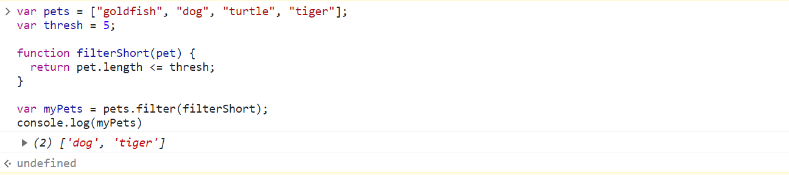
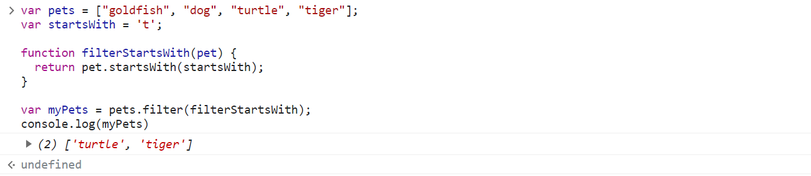
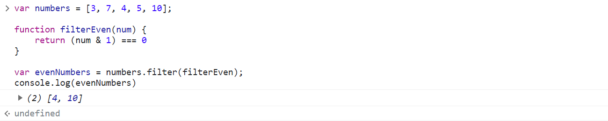

# In-Class Group Challenges

## Question 1

```JavaScript
var pets = ["goldfish", "dog", "turtle", "tiger"];
var thresh = 5;

function filterShort(pet) {
  return pet.length <= thresh;
}

var myPets = pets.filter(filterShort);
console.log(myPets)
```


---
## Question 2

```JavaScript
var pets = ["goldfish", "dog", "turtle", "tiger"];
var startsWith = 't';

function filterStartsWith(pet) {
  return pet.startsWith(startsWith);
}

var myPets = pets.filter(filterStartsWith);
console.log(myPets)
```


---
## Question 3

```JavaScript
var numbers = [3, 7, 4, 5, 10];

function filterEven(num) {
    return (num & 1) === 0
}

var evenNumbers = numbers.filter(filterEven);
console.log(evenNumbers)
```

